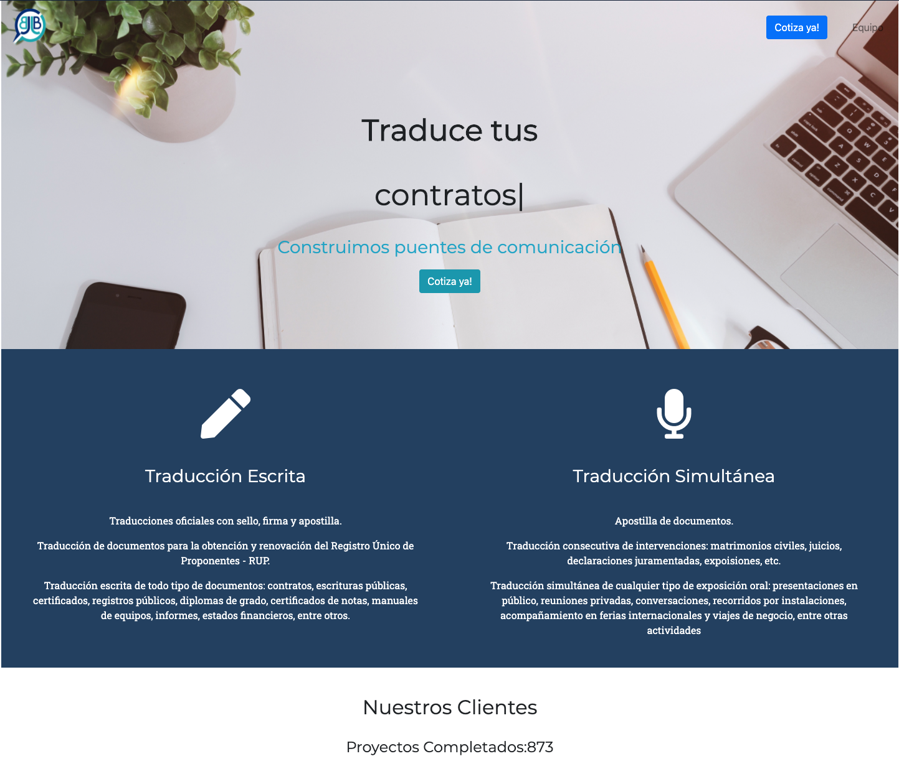

# BjjB Landing Page

> Render a website's landing page using React to animate different video components

BJJB is a translation agency serving in Barranquilla, Colombia. They needed a website to close new deals. I created a simple website to showcase their services and connect a simple contact form with their manager account. The project is just a start and we plan to build a blog functionality as well as the same webpage in different languages. For now, we have created the page in Spanish which is their base language for most of their clients.

## Built With

- HTML.
- CSS.
- React.
- Node js.
- Email js
- Bootstrap.

## Live Demo

[Live Demo Link](https://traduccionesjbc.com/)

## Authors

👤 **Santiago Rodriguez**

- Github: [@santiagorodriguezbermudez](https://github.com/santiagorodriguezbermudez)
- Twitter: [@srba87](https://twitter.com/srba87)
- Linkedin: [srba87](https://www.linkedin.com/in/srba87/)

## 🤝 Contributing

Contributions, issues and feature requests are welcome!

Feel free to check the [issues page](issues/).

## Show your support

Give a ⭐️ if you like this project!

## 📝 License

This project is [MIT](lic.url) licensed.

## Available Scripts

In the project directory, you can run:

### `npm start`

Runs the app in the development mode. 
Open [http://localhost:3000](http://localhost:3000) to view it in the browser.

The page will reload if you make edits. 
You will also see any lint errors in the console.
